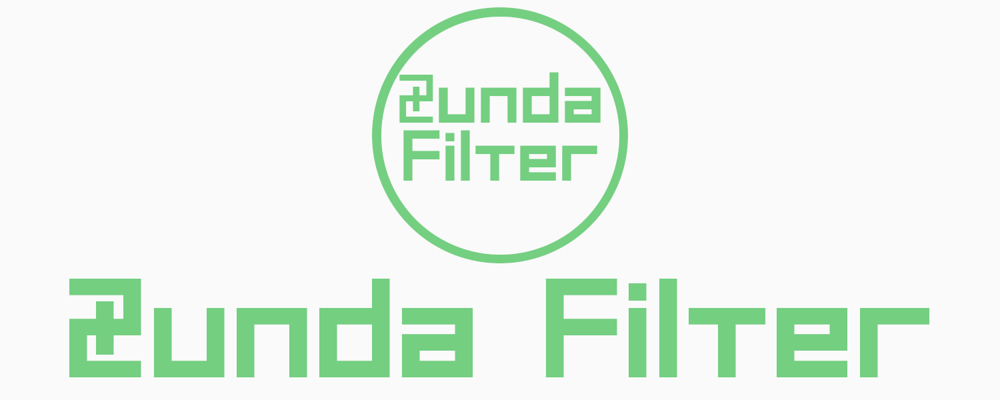

<h2 align="center">全てのテキストをずんだへ</h2>

<p align="center">
<a alt="code: Golang" href="https://go.dev/">
  
</a>
<a alt="MIT License" href="https://kawakawaritsuki.mit-license.org/">
  
</a>
</p>

# build and run

1.build

```shell
cd ./data
./setup.sh
cd ..
make clean
make build
```

2.run

```shell
echo "継ぎます" | ./bin/zundaFilter
```

# attention

file for test

+ `./data/convert.sh`
+ `./data/source.txt`
